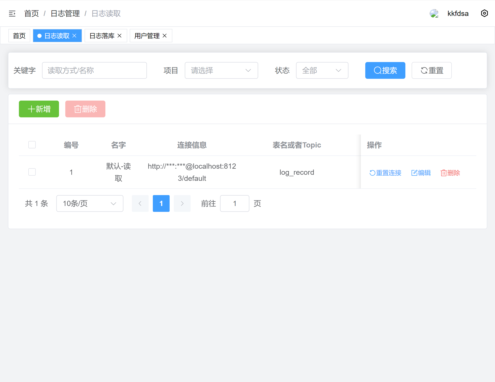

## 项目简介

iceslog 主要处理和日志相关的数据信息整合。

## 项目包含
- **后端**：[backend](./backend/) 由FastApi为支持的后端结构，[相关详情](./backend/README.md)
- **前端**：[frontend](./frontend/) 基于[vue3-element-admin](https://gitee.com/youlaiorg/vue3-element-admin)为底建立的vue的前端展示结构，[相关详情](./frontend/README.md)

## 项目特色

- **简洁易用**：只要简单的配置相关数据库的信息即可以快速的使用。
- **权限管理**：用户、角色、菜单、字典等完善的权限系统功能。
- **日志存储**：目前可用ClickHouse进行相关存储。

## 系统界面

### 日志每分钟

### 日志落库配置
可配置项目区分到消息队列Kafka或者ClickHouse中

### 日志读取配置
可配置项目从ClickHouse进行数据查询

### 日志查询配置
根据相应的信息进行日志查询
